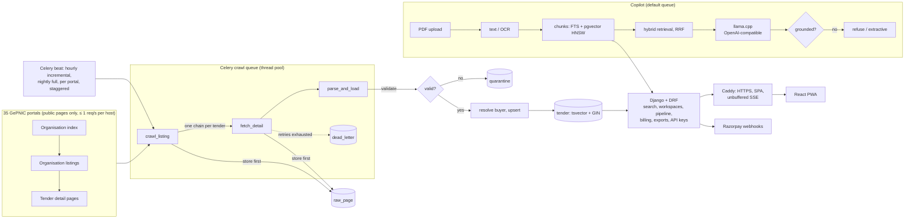

# TenderLens

TenderLens is a tender-intelligence SaaS for Indian public procurement. It **finds** every
open tender on 35 official NIC GePNIC portals (central, PSU, defence and 27 states and UTs),
helps a contractor **understand** the tender documents in minutes with a Copilot that runs on
our own open-weight LLM, and lets a team **manage** each bid until it is won. The build spec
is [docs/PLATFORM_V2.md](docs/PLATFORM_V2.md); section 5 sets out how it competes with
incumbents such as TenderDetail: published prices, AI on every plan, page citations,
visible data freshness, and an API.

**Find**
* Search with typo tolerance, prefixes and tender-ID lookup, disjunctive facets (sector,
  state, PIN area, value, type), an India map and a sector view (Postgres full-text +
  `pg_trgm`; no Elasticsearch)
* **Recommended for you**: open tenders matching the company profile's states, sectors and
  turnover (value ≤ 3 × annual turnover), each with its reasons
* Email alerts with the same search semantics, sent after each crawl
* `/coverage`: every portal with its open tenders and last successful crawl

**Understand (Copilot)**
* Upload the NIT/BOQ PDFs (OCR for scanned pages). The **Bid Brief** extracts EMD, fees,
  dates, pre-bid meeting, turnover and experience criteria, penalties and required
  documents by rule, with page citations, in milliseconds
* **Eligibility**: the brief compared with the company profile (eligible / not eligible /
  unknown, check by check)
* **Ask**: hybrid retrieval (Postgres FTS + pgvector, RRF) → a self-hosted LLM
  (llama.cpp, Qwen3.5-4B GGUF, any OpenAI-compatible server) → a grounding check that every
  number and date appears in a cited passage, else the answer is refused. If the LLM is down,
  the answer is built from the best passages instead (`mode: "extractive"`). No paid LLM API.

**Manage**
* Workspaces with owner/admin/member roles, invitations and seats
* Bid pipeline (watching → preparing → submitted → won/lost/dropped) with a kanban board,
  closing-soon reminders, and an **iCal feed** (bid due, pre-bid meeting, bid opening) for
  Google Calendar or Outlook
* CSV export, **OCDS 1.1** release packages, REST API keys
* Plans with published INR prices and quotas; self-serve Razorpay subscriptions
* Installable PWA, light/dark mode

**Stack:** Python 3.12 · Django 5.2 + DRF · PostgreSQL 16 (full-text, `pg_trgm`, pgvector) ·
Celery 5 + Redis · llama.cpp · sentence-transformers (multilingual-e5-small) · OCRmyPDF ·
React 19 + TypeScript + Tailwind 4 + TanStack Query · Docker · Caddy

| Doc | What is in it |
|---|---|
| [docs/PLATFORM_V2.md](docs/PLATFORM_V2.md) | Build spec, API contract, competitive positioning, status and next steps |
| [docs/SOURCE_NOTES.md](docs/SOURCE_NOTES.md) | The 35 portals, rejected ones, why award data is not collected, cross-portal duplicates |
| [docs/SAAS.md](docs/SAAS.md) | Workspaces, pipeline, calendar, recommendations, API keys, exports, billing |
| [docs/DEPLOY.md](docs/DEPLOY.md) | Production runbook: VPS, Caddy, backups, monitoring, monthly cost |
| [llm/README.md](llm/README.md) | Model choice, serving, prompt, QLoRA fine-tuning kit, LLM evaluation |
| [docs/INTERVIEW_NOTES.md](docs/INTERVIEW_NOTES.md) | The non-obvious engineering decisions, explained |

## Quickstart (development)

```
cp .env.example .env            # then set DJANGO_DEBUG=true and DEV_LOGIN_ENABLED=true
make up                         # postgres, redis, web, workers, beat, mailpit, caddy → http://localhost:8080
make crawl SOURCE=central MODE=full
```

**No `docker compose` plugin on the host?** Every compose target takes `COMPOSE=`; run
Compose from the official CLI image instead:

```
make up COMPOSE="docker run --rm -v /var/run/docker.sock:/var/run/docker.sock -v $PWD:$PWD -w $PWD docker:27-cli compose"
```

Running Django on the host instead (what the tests do): start only `postgres` and `redis`,
run `uv sync --frozen --extra copilot` once (the Copilot's embedding model needs torch, which
is an optional extra so the Vercel build stays under its 500 MB function limit), then
`uv run --frozen python manage.py migrate && uv run --frozen python manage.py runserver`.
Settings come from the process environment (not from `.env`), so export `DJANGO_DEBUG=true
DEV_LOGIN_ENABLED=true` for the any-email dev sign-in, and `CELERY_TASK_ALWAYS_EAGER=true`
if no worker is running. The Copilot's LLM is optional: start it with
`COMPOSE_PROFILES=llm` or see [llm/README.md](llm/README.md); without it, answers are
extractive. The frontend dev server (`npm run dev` in `frontend/`) proxies `/api` to
`localhost:8000`. If the host's node is broken, use
`docker run --rm -u $(id -u):$(id -g) -e HOME=/tmp -v "$PWD/frontend":/app -w /app node:22-bookworm-slim npm …`.

## Numbers from a real crawl

<!-- NUMBERS:START -->
**Integration run, 6 October 2026** (all 35 portals, live, through the real pipeline; a
bounded check, not a full crawl: up to 25 organisations and 15 detail pages per portal,
≤ 1 request/second per host):

| | |
|---|---|
| Portals | **35 / 35** runs succeeded (`central` needed a second attempt: its organisation index timed out 4 × 30 s, then loaded with a 120 s timeout); 34 have open tenders today, Mizoram lists 0 |
| Pages | 548 listing pages and 478 detail pages fetched in about 5 minutes (12 portals at a time) |
| Loaded | **472 new + 6 updated** tenders, **0** quarantined, **0** dead letters, **0** organisation count mismatches; 339 unchanged tenders skipped by the incremental plan |
| Database after the run | 3,158 tenders from 34 portals, 2,397 open; 1,132 with a pre-bid meeting date (1,002 backfilled from stored pages) |
| Cross-portal duplicates | **0** by (reference number, closing time) and **0** by tender ID, so no linking rule was added (docs/SOURCE_NOTES.md) |
| End-to-end smoke (HTTP, real data) | recommendations 51 matches in 53 ms; calendar feed valid (CRLF, ≤ 75-octet folding, escaping) with a pre-bid event; CSV 402 on free, 397 rows after upgrading; OCDS page of 100 |
| Copilot | upload → ready in 10 s (4 pages); brief 12 fields with page citations; live LLM answer **37 s**, `mode: llm`, cited and grounded; LLM down → extractive answer |

Measured on 2 October 2026 against the live portals (`manage.py crawl_report` and
`make er-eval` print these from the database).

| | |
|---|---|
| Tenders ingested | **2,686** (2,549 central portal + 137 Madhya Pradesh), 35 states, ₹65,965 crore of disclosed value |
| Full crawl, central portal | **47 min** for 2,802 pages at ≤ 1 req/s; **2,549 / 2,549** tenders accounted for (2,537 new, 1 updated, 9 unchanged, 2 quarantined) — exactly the count the portal's index claims |
| Incremental crawl (hourly job) | **4.8 min**, 283 pages through Celery: 2,519 tenders skipped (listing row unchanged, no detail fetch), 28 updated (corrigenda), 2 re-fetched (the 2 previously quarantined) |
| Duplicates | **0** duplicate rows; 2,712 re-seen tenders upserted in place or skipped across 7 runs |
| Failures | 0 dead letters; 2 rows quarantined by validation (a real, transient portal bug, see below), which loaded on their own in the next crawl |
| Worker killed with `SIGKILL` mid-crawl | 135/137 loaded, 0 duplicates; the 2 in-flight tasks were never redelivered and the next incremental crawl fetched exactly those 2 (see `docs/INTERVIEW_NOTES.md`) |
| Raw HTML stored | 3,000 pages: 219 MB of HTML, **74 MB on disk** (lz4 TOAST) |
| Entity resolution, precision | **100%** (0 false merges) on 120 hand-labelled real name pairs; plain `token_set_ratio` merged 40 of them wrongly (0% precision) |
| Entity resolution, recall | **95%** (57/60) on synthetic spelling variants of real names; the 3 misses are typos in the first word, which first-token blocking never compares |

**Two real data-quality bugs caught by validation.** For tenders `2026_RMLH_926750_1` and
`2026_THDC_925930_1`, the portal's detail page shows a *Published Date* one month after
the true date, stamped with the server's current time-of-day (e.g. "18-Oct-2026 02:24 AM"
when fetched at 02:24 on 2 Oct). The listing page and "Bid Submission Start" fields have
the correct date. Because closing (3 Oct) is before that "published" date, the rows went
to quarantine with readable errors instead of being loaded. The glitch was transient: the
next incremental crawl re-fetched both (they were not in the table), the portal now served
the correct dates, and both loaded automatically. One broken page is kept as a fixture:
`tests/fixtures/broken/real_published_after_closing.html`.

**What entity resolution actually faces on GePNIC.** Organisation names are chosen from a
managed hierarchy, so true spelling variants within a portal are rare. The real risk is
*false merges between siblings*: "DDA ‖ CE-North Zone" vs "DDA ‖ CE-South Zone", "MoRTH
‖ P1 Delhi" vs "P2 Delhi", "NHPC ‖ Chamera-II" vs "Chamera-III". Plain `token_set_ratio`
scores those 90+, and during the first crawl it merged 150 names (six DDA zones into one
"buyer"). With the guards, all 573 names stay distinct, and 112 near-pairs wait in the
review list. The labelled sets are `data/er_labels.csv` (real, one annotator) and
`data/er_synthetic.csv` (generated by `manage.py er_pairs --synthetic`).
<!-- NUMBERS:END -->

## Architecture



### Request path for one tender

1. `crawl_listing` fetches the organisation index (which also says how many tenders each
   organisation has) and every organisation's listing page. Each page goes into
   `raw_page` **before** it is parsed.
2. In incremental mode, a tender whose listing row (title, published and closing dates)
   matches the database is marked `skipped` and its detail page is not fetched. A
   corrigendum almost always moves a date, so a changed row is fetched again.
3. `fetch_detail` downloads the detail page and stores it. `parse_and_load` parses it,
   validates it, resolves the buyer and upserts it.
4. Each tender's fate is one `crawl_item` row (`new`, `updated`, `unchanged`, `skipped`,
   `quarantined`, `failed`). The run finishes when none is `pending`. Reconciliation then
   compares the index's claimed count, the listed rows, and what was accounted for.

## Design decisions and trade-offs

**Store raw HTML first, parse second.** Fetching and parsing are separate. A parser bug
or a new field never needs a re-crawl: `manage.py backfill FROM TO` re-parses stored
pages. Cost: storage. Mitigations: `raw_page.body` uses lz4 TOAST compression, and
index/listing pages are pruned after 7 days. Detail pages are kept.

**Idempotent upsert, with the hash computed from parsed fields.**

```sql
INSERT INTO tender (...) VALUES (...)
ON CONFLICT (source, source_tender_id) DO UPDATE SET ...
WHERE tender.content_hash <> EXCLUDED.content_hash
  AND tender.fetched_at  <= EXCLUDED.fetched_at
RETURNING id, (xmax = 0) AS inserted;
```

* The hash covers business fields only. Hashing the HTML would not work, because every
  GePNIC page embeds a visitor counter and session tokens that change on each request.
* `WHERE … content_hash <>` makes a re-crawl of unchanged data write nothing.
* `fetched_at <=` means a backfill that replays an *older* page can never overwrite newer
  data.
* `xmax = 0` is only true for a freshly inserted row, so one statement tells `new` from
  `updated`.
* The unique constraint, `closes_at >= published_at` and `value_inr >= 0` are also
  database `CHECK`/`UNIQUE` constraints, as defence in depth behind validation.

**Surviving a worker crash.** Tasks run with `acks_late` and `reject_on_worker_lost`, so a
task that was running when its worker died is delivered again. Every step is idempotent
(the upsert above, `crawl_item` keyed by run and tender), so redelivery is harmless.
Counters are computed from `crawl_item` when the run finishes, not incremented as tasks
go, so a redelivered task cannot inflate them. `tests/test_tasks.py` reproduces the
crash: it kills the pipeline between fetch and load, then redelivers every task.

**Failures are recorded, never dropped.**
* Transient errors: the fetcher retries 429/5xx and transport errors with exponential
  backoff (and honours `Retry-After`).
* `fetch_detail` then retries up to 5 more times with Celery backoff. After that, the URL
  goes to `dead_letter` and the tender is marked `failed`, so the run can still finish.
* Rows that fail validation go to `quarantine` with readable, per-field errors.
* A run whose numbers don't add up is marked `mismatch`, and `/health` reports it.

**Politeness.** At most one request per second per host. The budget is shared across
every worker through a Redis `SET NX PX` key, so adding workers never makes the crawler
faster against the portal. It sends an honest User-Agent with a contact URL, uses only
public pages, and never touches a CAPTCHA. (GePNIC's own search forms and document
downloads are CAPTCHA-gated, so TenderLens does not use them. The organisation listing
and tender detail pages are public.)

**GePNIC sessions.** Detail links only work inside a live server session. When the portal
answers "Stale Session", the crawler starts a new session and retries the same link
(verified against the live portal). Celery tasks share the session cookie through
Redis.

**Entity resolution.** Buyer = the first two levels of the organisation chain
(`Ministry || Department`). Deeper levels are individual offices.
* *Normalise:* lowercase, strip punctuation, drop fillers (`office`, `of`, `the`,
  `govt`), expand abbreviations (`PWD` → `public works department`, `ASI`, `AIIMS`, …).
* *Block:* compare only names in the same state (the state the buyer tenders in most)
  that share the first normalised token. Blocking by state, not by portal, lets a buyer
  that publishes on both the central and a state portal be matched.
* *Match:* RapidFuzz `token_set_ratio`. ≥ 90 merges automatically; 80–90 goes to a
  review list (`manage.py er_review`).

Plain `token_set_ratio` scores what two names share and largely ignores what differs.
That merges siblings: "ASI || Delhi Circle" vs "ASI || Agra Circle", "AIIMS Bhopal" vs
"AIIMS Raipur", "Division No 1" vs "No 2". Two guards fix this, and the labelled
evaluation below measures their effect:
1. Organisation and department parts are scored separately; the lower score wins.
2. A token that appears on one side only, and is not a misspelling of a token on the
   other side, caps the score at 85 (the review band). "Merrut"/"Meerut" still merges;
   "Delhi"/"Agra" does not.

**Search** is Postgres only (`tenders/search.py`; Elasticsearch was dropped: one database,
no second index to keep in sync). `tender.search_vector` is a STORED generated `tsvector`
(title A, stemmed and as written; tender ID / reference number A; buyer C; location and
organisation chain D) with a GIN index, so every write path keeps it current. A query is
`websearch_to_tsquery` syntax with every word a prefix (`constr` finds "construction"),
ranked by `ts_rank_cd` so a title match outranks a buyer-name match; an exact tender ID or
reference number ranks first. When nothing matches, unknown words are corrected against
the data's own vocabulary with `pg_trgm` + Levenshtein ("toliet" -> "toilet",
`corrected` in the response); a multi-word query that still finds nothing falls back to
any word (`relaxed: true`).

**Sectors.** `tenders/sectors.py` combines, in order: distinctive title words (CCTV,
software), the portal's *specific* Product Category ("Civil Works - Highways"), ordered
title keyword rules, the portal's *generic* category ("Civil Works"), and finally the tender
category. The generic categories alone cover 40% of tenders ("Civil Works" is 778 of
2,686), which is why title rules sit between the specific and generic categories. Every
rule that was added came from a real misclassified title; those titles are now test cases.

**Facets are disjunctive.** Each filter group's counts ignore that group's own filter
(one `GROUP BY` per group with every *other* group's filter applied), so after picking
"Roads" the sector list still shows the other sectors' counts.

**Alerts are at-least-once, never duplicated.** A digest lists open tenders first seen
since the alert's high-water mark that it hasn't been sent before (`alert_delivery` is
unique per alert and tender). If the SMTP send fails, nothing is recorded and the next
run retries. Alerts run when a crawl run that found new tenders finishes, and hourly as
a fallback.

**Sign-in.** Google Identity Services gives the browser a signed ID token. Django
verifies its signature, audience, issuer and verified email (`google-auth`), then starts
an ordinary session. No Google access tokens or passwords are ever stored. Login POSTs
are CSRF-protected too, so a hostile page can't sign you into someone else's account.

**State.** State portals know their own state. For the central portal, the state comes
from the pincode (India Post circle prefixes, with 3/4-digit overrides for Goa,
Uttarakhand, the North-East, etc.).

## API

OpenAPI docs: `/api/docs/` (schema at `/api/schema/`).

| Endpoint | Purpose |
|---|---|
| `GET /api/tenders?q=&state=&category=&min_value=&max_value=&closes_before=&closes_after=&buyer=&source=&page=&page_size=` | Search and filter, paginated, with facet counts |
| `GET /api/tenders/{id}` | One tender with organisation chain, dates and provenance |
| `GET /api/buyers/{id}` | Buyer entity: every merged spelling, tender count, total value |
| `GET /api/tenders/{id}/similar` | Open tenders with similar titles, same sector first |
| `GET /api/stats` | Open tenders by state, tenders closing in the next 7 days, last crawl |
| `GET /api/sectors` | Open tenders, closing this week and value per sector |
| `GET /api/map?sector=` | Per-state open tenders, closing this week, value, most common sector |
| `GET /api/config` | Public runtime settings (Google client ID, dev login) |
| `GET /api/auth/me`, `POST /api/auth/google`, `POST /api/auth/logout` | Session sign-in with a Google ID token (verified server-side) |
| `GET/POST /api/alerts`, `PATCH/DELETE /api/alerts/{id}`, `POST /api/alerts/{id}/test` | Your email alerts (signed in) |
| `POST /api/alerts/preview` | How many open tenders match some alert criteria right now |
| `GET /api/alerts/unsubscribe?token=` | One-click unsubscribe (signed link from the email) |
| `POST /api/feedback` | Bug reports, data issues, ideas |
| `GET /api/sources` | Every portal: open tenders, last run, last successful crawl |
| `GET /api/recommendations` | Open tenders matching the company profile, with reasons |
| `/api/copilot/documents`, `…/brief`, `…/eligibility`, `POST /api/copilot/ask` (SSE) | Copilot: upload PDFs, Bid Brief, eligibility, cited answers |
| `/api/workspace…` | Workspace, company profile, members, invites, API keys, calendar token |
| `/api/pipeline…`, `GET /api/pipeline/calendar.ics?token=` | Bid pipeline, summary, iCal feed |
| `GET /api/export/tenders.csv`, `GET /api/ocds/releases` | CSV export (paid plans), OCDS 1.1 release packages (public) |
| `/api/billing/plans`, `subscription`, `checkout`, `cancel`, `webhook` | Plans, Razorpay subscriptions |
| `GET /health` | Database / Redis status and crawl monitoring |

Exact request and response shapes: section 3 of [docs/PLATFORM_V2.md](docs/PLATFORM_V2.md)
and [docs/SAAS.md](docs/SAAS.md). REST API customers send `Authorization: Api-Key tl_…`;
plan limits answer HTTP 402 `{"detail", "code": "quota_exceeded", "limit"}`.

## Running it

| Command | What it does |
|---|---|
| `make up` | Build and start the whole stack, wait for health checks |
| `make crawl [SOURCE=central] [MODE=incremental\|full]` | Queue a crawl on the Celery workers |
| `make crawl-sync` | Same crawl in the foreground, no Celery |
| `manage.py crawl --source up --sync --max-orgs 25 --max-details 15` | A bounded live check of one portal (what the integration run used) |
| `make backfill FROM=2026-10-01 TO=2026-10-02` | Re-parse stored pages (idempotent) |
| `make test` | Backend test suite (needs Postgres/Redis: `docker compose up -d postgres redis`) |
| `make lint` | `ruff check`, `ruff format --check`, `makemigrations --check` |
| `manage.py copilot_eval --pdfs ../docintel/data/pdfs/synthetic` | Copilot retrieval, brief and answer evaluation |
| `make er-eval` | Entity-resolution precision/recall on the labelled real and synthetic pairs |
| `make admin` | Create a Django admin user (feedback, alerts, crawl runs at `/admin/`) |

Local development: `docker compose` also runs **Mailpit**, which catches every email at
http://localhost:8025. With `DJANGO_DEBUG=true` and `DEV_LOGIN_ENABLED=true` in `.env`,
the sign-in box accepts any email so you can try alerts, the pipeline and the Copilot
without a Google client ID. With `BILLING_PROVIDER=fake` (the default when DEBUG is on),
checkout activates a paid plan at once.

Sources (`CRAWLER_SOURCES` in `.env`): `all` (default) or comma-separated keys from
`ingest/sources.py`: 35 verified GePNIC portals (central, PSU, defence and 27 states and
union territories), all sharing one parser. Each gets an hourly incremental and a nightly full
crawl, staggered. Verification, rejected portals and why award data is not collected:
[docs/SOURCE_NOTES.md](docs/SOURCE_NOTES.md).

### Deploying (production)

One VPS, `deploy/compose.prod.yml`: Caddy (automatic HTTPS, serves the React build, streams
Copilot answers unbuffered) → gunicorn (gthread) → Postgres 16 + pgvector, Redis, a Celery
`crawl` worker (thread pool, 35 portals at ≤ 1 req/s each), a `default` worker (Copilot OCR and
embeddings, alerts, email), beat, and optionally the llama.cpp LLM (`COMPOSE_PROFILES=llm`).
Migrations run once in a one-shot `migrate` service before anything else starts, and
`DJANGO_PRODUCTION=true` refuses to boot with a development `.env`.

| Command | What it does |
|---|---|
| `make prod-build prod-up` | Build both images (tagged with the commit) and start or update the stack |
| `make prod-deploy` | `git pull`, back up, rebuild, roll out |
| `make prod-rollback TAG=<sha>` | Run an earlier build |
| `make prod-backup` / `make restore-check` | Nightly backup (pg_dump + media, verified, rclone off-site) / restore drill into a scratch DB |

Sizing, DNS, first deploy, Razorpay webhook, OCDS prefix, backups, upgrades, monitoring and a
monthly cost table: [docs/DEPLOY.md](docs/DEPLOY.md).

## Tests

<!-- TESTS:START -->
**437 backend tests** (`uv run --frozen pytest -m "not llm"`, 35 s) and **68 frontend tests**
in 13 files (`npm test`, Vitest + Testing Library), plus `tsc -b` and a production build.
Backend tests run against real Postgres (pgvector image) and Redis, as CI does; give each
parallel run its own database with `TEST_DB_NAME=test_<name>`. Parser tests use pages
saved from the live portals (`tests/fixtures/`); crawl tests serve them through a fake
portal (`respx`), so nothing touches the network. Tests marked `llm` call a live LLM
server and are skipped by default.

| File | What it proves |
|---|---|
| `test_parser.py` (25) | Every saved page parses: 252 organisations / 2,549 tenders on the index, 269-row listing, all 18 detail pages; stale-session pages are detected |
| `test_validation.py` (17) | Indian number format, IST dates, `closes_at ≥ published_at`, non-negative values, readable errors |
| `test_loader.py` (12) | Load twice → same rows; changed content updates and keeps `first_seen`; an older page never overwrites newer; broken pages land in quarantine |
| `test_pipeline.py` (10) | Crawl twice → zero duplicates; raw pages stored first; incremental skip; stale session renewal; 503 retry; dead-letter; reconciliation mismatch |
| `test_tasks.py` (12) | Celery chain; worker killed between fetch and load, then every task redelivered → correct counts; retries exhausted → dead letter |
| `test_sources.py` (22) | The 35-portal registry, new portals' index/listing/detail pages, portal state vs pincode state, scheduling, `/api/sources` |
| `test_resolution.py` (39) | Normalisation, abbreviation and typo merges, blocking, review band, sibling departments *not* merged, pincode → state |
| `test_search.py` (22) | Postgres search: misspelled, stemmed and partial queries; tender-ID lookup; facets equal DB counts; title outranks buyer; relaxed fallback |
| `test_api.py` (11) | Every public endpoint, filters, pagination, 400s, OpenAPI schema complete and free of warnings |
| `test_accounts.py` (10) | Google sign-in with a verified token, forged tokens rejected, CSRF on login, dev login off unless DEBUG |
| `test_alerts.py` (19) | Digests never repeat, PIN-area matching, failed SMTP retries, alert creation survives a failed first digest, unsubscribe, isolation |
| `test_feedback_sectors_map.py` (32) | Sector rules on real titles, map regions, sectors/map/similar/config endpoints, feedback + honeypot |
| `test_commands.py` (7) | `crawl --sync` (incl. `--max-details`), `backfill`, `resolve_buyers --rebuild`, `er_pairs`/`er_eval` |
| `test_copilot.py` (24) | Extraction, chunking, retrieval fusion, grounding, Bid Brief fields, eligibility rules, LLM fallback |
| `test_copilot_api.py` (24) | Upload/list/delete, brief, eligibility, SSE and JSON answers, quotas and refunds, organisation isolation |
| `test_workspaces.py` (47) | Roles, members, invites (expiry, tampering, seats), workspace switching, IDOR, API keys (feature gate, downgrade, scope) |
| `test_pipeline_api.py` (17) | Pipeline CRUD, team sharing, IDOR, summary, daily reminders, iCal feed (validity, token rotation, UTF-8-safe folding, escaping) |
| `test_recommendations.py` (5) | Profile matching with reasons, states-only profile, pagination and filters, empty profile, sign-in required |
| `test_exports.py` (11) | CSV (feature gate, truncation headers), OCDS 1.1 packages and paging |
| `test_billing.py` (24) | Plans, fake and Razorpay checkout, webhook signature and idempotency, plan follows subscription |
| `test_entitlements.py` (10) | Plans match the price list, race-safe quotas, monthly reset (IST), 402 body, feature gates |
| `test_followups.py` (37) | Chunk context for global recall, pre-bid date parsing/backfill/ICS, Razorpay supersede-cancel, alerts via Postgres search |
<!-- TESTS:END -->

## Limitations

* **GePNIC detail links are session-bound**, so the stored `url` does not open in a
  browser. The UI tells users to search the portal by Tender ID.
* **Tender documents (NIT/BOQ PDFs) are behind a CAPTCHA** on GePNIC and are not
  downloaded; users upload them to the Copilot themselves.
* **No award or bidder data yet:** every public results page is CAPTCHA-gated, so it
  needs a data-sharing agreement (docs/SOURCE_NOTES.md).
* **GeM and CPPP are not crawled** (protected or CAPTCHA-gated); see docs/SOURCE_NOTES.md.
* `value_inr = 0` on the portal usually means "not disclosed"; it is stored as 0 and
  shown as "Not disclosed".
* Pincode → state is right for the vast majority of PINs. It is not a post-office
  directory: a few border PINs can land in the neighbouring state.
* Entity-resolution labels were made by one annotator (the real pairs) or generated (the
  synthetic variants). Re-check `data/er_labels.csv` yourself before quoting the numbers.
* About 37% of tenders have no disclosed value (`NA` or `0.00` on the portal).
