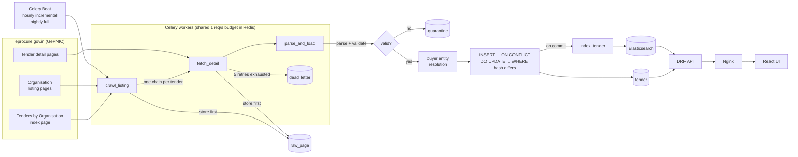

# TenderLens

Crawls public Indian government tenders from NIC's GePNIC portals, stores them
idempotently in PostgreSQL, resolves buyer-organisation spellings into entities, and
serves everything through a searchable REST API and a small React UI.

**Stack:** Python 3.12 · Django 5.2 + DRF · PostgreSQL 16 · Celery 5 + Redis ·
Elasticsearch 8 · React 19 + TypeScript · Docker · Nginx

```
make up            # postgres, redis, elasticsearch, web, worker, beat, nginx → http://localhost:8080
make crawl MODE=full
make test
```

## Numbers from a real crawl

<!-- NUMBERS:START -->
_Filled in from the first full crawl; see "How the numbers were measured" below._
<!-- NUMBERS:END -->

## Architecture



### Request path for one tender

1. `crawl_listing` fetches the organisation index (which also says how many tenders each
   organisation has) and every organisation's listing page. Each page goes into
   `raw_page` **before** it is parsed.
2. In incremental mode, a tender whose listing row (title, published and closing dates)
   matches the database is marked `skipped` and its detail page is not fetched. A
   corrigendum almost always moves a date, so a changed row is fetched again.
3. `fetch_detail` downloads the detail page and stores it. `parse_and_load` parses it,
   validates it, resolves the buyer and upserts it.
4. Each tender's fate is one `crawl_item` row (`new`, `updated`, `unchanged`, `skipped`,
   `quarantined`, `failed`). The run finishes when none is `pending`. Reconciliation then
   compares the index's claimed count, the listed rows, and what was accounted for.

## Design decisions and trade-offs

**Store raw HTML first, parse second.** Fetching and parsing are separate. A parser bug
or a new field never needs a re-crawl: `manage.py backfill FROM TO` re-parses stored
pages. Cost: storage. Mitigations: `raw_page.body` uses lz4 TOAST compression, and
index/listing pages are pruned after 7 days. Detail pages are kept.

**Idempotent upsert, with the hash computed from parsed fields.**

```sql
INSERT INTO tender (...) VALUES (...)
ON CONFLICT (source, source_tender_id) DO UPDATE SET ...
WHERE tender.content_hash <> EXCLUDED.content_hash
  AND tender.fetched_at  <= EXCLUDED.fetched_at
RETURNING id, (xmax = 0) AS inserted;
```

* The hash covers business fields only. Hashing the HTML would not work, because every
  GePNIC page embeds a visitor counter and session tokens that change on each request.
* `WHERE … content_hash <>` makes a re-crawl of unchanged data write nothing.
* `fetched_at <=` means a backfill that replays an *older* page can never overwrite newer
  data.
* `xmax = 0` is only true for a freshly inserted row, so one statement tells `new` from
  `updated`.
* The unique constraint, `closes_at >= published_at` and `value_inr >= 0` are also
  database `CHECK`/`UNIQUE` constraints, as defence in depth behind validation.

**Surviving a worker crash.** Tasks run with `acks_late` and `reject_on_worker_lost`, so a
task that was running when its worker died is delivered again. Every step is idempotent
(the upsert above, `crawl_item` keyed by run and tender), so redelivery is harmless.
Counters are computed from `crawl_item` when the run finishes, not incremented as tasks
go, so a redelivered task cannot inflate them. `tests/test_tasks.py` reproduces the
crash: it kills the pipeline between fetch and load, then redelivers every task.

**Failures are recorded, never dropped.**
* Transient errors: the fetcher retries 429/5xx and transport errors with exponential
  backoff (and honours `Retry-After`).
* `fetch_detail` then retries up to 5 more times with Celery backoff. After that, the URL
  goes to `dead_letter` and the tender is marked `failed`, so the run can still finish.
* Rows that fail validation go to `quarantine` with readable, per-field errors.
* A run whose numbers don't add up is marked `mismatch`, and `/health` reports it.

**Politeness.** At most one request per second per host. The budget is shared across
every worker through a Redis `SET NX PX` key, so adding workers never makes the crawler
faster against the portal. It sends an honest User-Agent with a contact URL, uses only
public pages, and never touches a CAPTCHA. (GePNIC's own search forms and document
downloads are CAPTCHA-gated, so TenderLens does not use them. The organisation listing
and tender detail pages are public.)

**GePNIC sessions.** Detail links only work inside a live server session. When the portal
answers "Stale Session", the crawler starts a new session and retries the same link
(verified against the live portal). Celery tasks share the session cookie through
Redis.

**Entity resolution.** Buyer = the first two levels of the organisation chain
(`Ministry || Department`). Deeper levels are individual offices.
* *Normalise:* lowercase, strip punctuation, drop fillers (`office`, `of`, `the`,
  `govt`), expand abbreviations (`PWD` → `public works department`, `ASI`, `AIIMS`, …).
* *Block:* compare only names in the same state (the state the buyer tenders in most)
  that share the first normalised token. Blocking by state, not by portal, lets a buyer
  that publishes on both the central and a state portal be matched.
* *Match:* RapidFuzz `token_set_ratio`. ≥ 90 merges automatically; 80–90 goes to a
  review list (`manage.py er_review`).

Plain `token_set_ratio` scores what two names share and largely ignores what differs.
That merges siblings: "ASI || Delhi Circle" vs "ASI || Agra Circle", "AIIMS Bhopal" vs
"AIIMS Raipur", "Division No 1" vs "No 2". Two guards fix this, and the labelled
evaluation below measures their effect:
1. Organisation and department parts are scored separately; the lower score wins.
2. A token that appears on one side only, and is not a misspelling of a token on the
   other side, caps the score at 85 (the review band). "Merrut"/"Meerut" still merges;
   "Delhi"/"Agra" does not.

**Search.** Elasticsearch has `title` analysed in English (stemming) plus an edge-n-gram
sub-field for partial words. Queries use `fuzziness: AUTO` for typos. `buyer`, `state` and
`category` are keywords for facets; value and dates are numeric/date for ranges. A tender
is re-indexed by a Celery task after each upsert commits. If Elasticsearch is down,
`/api/tenders` falls back to Postgres (`icontains` on a trigram index) and computes
facets with `GROUP BY`. The response's `search_backend` field says which engine
answered.

**State.** State portals know their own state. For the central portal, the state comes
from the pincode (India Post circle prefixes, with 3/4-digit overrides for Goa,
Uttarakhand, the North-East, etc.).

## API

OpenAPI docs: `/api/docs/` (schema at `/api/schema/`).

| Endpoint | Purpose |
|---|---|
| `GET /api/tenders?q=&state=&category=&min_value=&max_value=&closes_before=&closes_after=&buyer=&source=&page=&page_size=` | Search and filter, paginated, with facet counts |
| `GET /api/tenders/{id}` | One tender with organisation chain, dates and provenance |
| `GET /api/buyers/{id}` | Buyer entity: every merged spelling, tender count, total value |
| `GET /api/stats` | Open tenders by state, tenders closing in the next 7 days, last crawl |
| `GET /health` | Database / Redis / Elasticsearch status and crawl monitoring |

## Running it

| Command | What it does |
|---|---|
| `make up` | Build and start the whole stack, wait for health checks |
| `make crawl [SOURCE=central] [MODE=incremental\|full]` | Queue a crawl on the Celery workers |
| `make crawl-sync` | Same crawl in the foreground, no Celery |
| `make backfill FROM=2026-10-01 TO=2026-10-02` | Re-parse stored pages (idempotent) |
| `make test` | Test suite (needs `make up` for Postgres/Redis/ES) |
| `make er-eval` | Entity-resolution precision on the labelled pairs |
| `make reindex` | Rebuild the Elasticsearch index from Postgres |

Sources (`CRAWLER_SOURCES` in `.env`): `central` (eprocure.gov.in), plus `mp`, `odisha`,
`kerala` and `rajasthan`. All run GePNIC and share one parser.

Deploying to an Ubuntu server, nightly backups and monitoring: [docs/DEPLOY.md](docs/DEPLOY.md).

## Tests

<!-- TESTS:START -->
<!-- TESTS:END -->

## Limitations

* **GePNIC detail links are session-bound**, so the stored `url` does not open in a
  browser. The UI tells users to search the portal by Tender ID.
* **Tender documents (NIT/BOQ PDFs) are behind a CAPTCHA** on GePNIC and are not
  downloaded.
* `value_inr = 0` on the portal usually means "not disclosed"; it is stored as 0 and
  shown as "Not disclosed".
* Pincode → state is right for the vast majority of PINs. It is not a post-office
  directory: a few border PINs can land in the neighbouring state.
* Entity-resolution labels were made by one annotator. See `data/er_labels.csv` and
  re-check before quoting the number.
